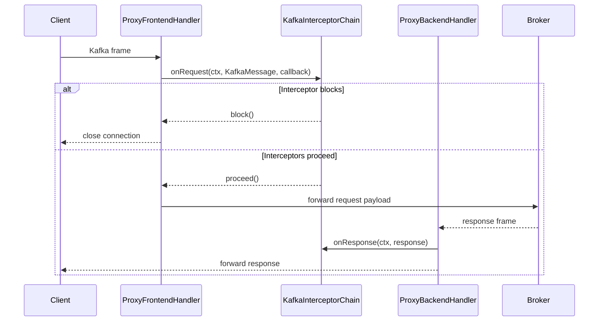

# Kafka Proxy: Detailed Design & Implementation Guide

## 1. Purpose and Scope

This document describes the end-to-end design of the Kafka Proxy, including runtime architecture, request/response flow, interceptor behavior, configuration model, and operational constraints.

The proxy is a **Netty-based Layer-7 Kafka gateway** that sits between Kafka clients and brokers. It decodes Kafka request headers, runs policy/feature interceptors, then forwards traffic to the backend cluster.

---

## 2. High-Level Architecture

### 2.1 Logical view

```mermaid
flowchart LR
    C[Kafka Client(s)] -->|TCP + Kafka protocol| P[Kafka Proxy]
    P -->|TCP + Kafka protocol| B[Kafka Broker / Cluster]

    subgraph P[Kafka Proxy Process]
      direction TB
      S[KafkaProxy server bootstrap]
      FP[Frontend pipeline\nLengthFieldBasedFrameDecoder\nLengthFieldPrepender\nKafkaProtocolHandler\nProxyFrontendHandler]
      IC[KafkaInterceptorChain]
      BP[Backend pipeline\nLengthFieldBasedFrameDecoder\nLengthFieldPrepender\nProxyBackendHandler]
      CFG[ProxyConfig\n(proxy.properties)]

      S --> FP
      FP --> IC
      IC --> BP
      CFG --> IC
    end
```

### 2.2 Core responsibilities by component

- **`KafkaProxy`**
  - Starts the Netty server, sets up the frontend pipeline, and stores mutable backend target (`remoteHost`, `remotePort`).
  - Supports runtime failover by updating backend destination through synchronized accessors.
- **`ProxyFrontendHandler`**
  - Accepts client-side traffic.
  - Creates backend connection on channel activation.
  - Runs request interceptors before forwarding.
- **`ProxyBackendHandler`**
  - Receives broker responses.
  - Invokes response hooks and forwards data back to the client channel.
- **`KafkaProtocolHandler`**
  - Parses Kafka request headers on frontend traffic and wraps frames into `KafkaMessage` for metadata-aware interception.
- **`KafkaInterceptorChain`**
  - Executes request interceptors in-order using callback-based async control (`proceed`/`block`).
  - Broadcasts responses to interceptors.
- **`ProxyConfig`**
  - Loads and conditionally wires interceptors from `proxy.properties`.

---

## 3. Runtime Pipeline Design

## 3.1 Frontend channel pipeline

For each inbound client channel, the proxy configures:

1. `LengthFieldBasedFrameDecoder(Integer.MAX_VALUE, 0, 4, 0, 4)`
   - Splits TCP stream into Kafka frames (4-byte length prefix protocol style).
2. `LengthFieldPrepender(4)`
   - Re-adds frame length for outbound writes.
3. `KafkaProtocolHandler`
   - Attempts Kafka header decode on frontend path.
   - Emits `KafkaMessage` on success, raw `ByteBuf` on fallback.
4. `ProxyFrontendHandler`
   - Runs `KafkaInterceptorChain.onRequest` for `KafkaMessage`.
   - Forwards payload to backend if allowed.

## 3.2 Backend channel pipeline

When frontend channel becomes active, `ProxyFrontendHandler` establishes an outbound channel with:

1. `LengthFieldBasedFrameDecoder`
2. `LengthFieldPrepender`
3. `ProxyBackendHandler`

`ProxyBackendHandler` calls `interceptorChain.onResponse(...)` and forwards the broker response to client.

## 3.3 Backpressure/read strategy

Both frontend and backend bootstraps set `AUTO_READ=false`, and handlers explicitly call `read()` only after successful write completion. This creates a simple manual flow-control loop and avoids uncontrolled buffering.

---

## 4. Request Lifecycle



---

## 5. Protocol Awareness Implementation

`KafkaProtocolHandler` checks whether it is executing on the frontend path (`frontendHandler` in pipeline) and then:

1. Parses request header via Kafka client library `RequestHeader.parse(ByteBuffer)`.
2. Captures API key/version, correlation ID, and client ID.
3. Wraps full frame into `KafkaMessage` for interceptors.
4. Falls back to forwarding raw buffer if parse fails.

`KafkaMessage` preserves both:
- `payload()` => full message (header + body)
- `body()` => body-only view starting after decoded header

This gives interceptors direct in-place `ByteBuf` mutation capability.

---

## 6. Interceptor Framework and Feature Catalog

## 6.1 Execution semantics

- Interceptors are stored in insertion order.
- Request path is callback-chained (`proceed` to continue, `block` to terminate).
- Response path iterates all interceptors via `onResponse` (default no-op).
- Async behavior is supported by invoking callback later (e.g., scheduled throttling/latency).

## 6.2 Built-in interceptors

| Interceptor | Primary behavior | Trigger/API scope | Notes |
|---|---|---|---|
| `AuditInterceptor` | Logs request metadata (API, version, correlation, client id, remote addr) | All decoded requests | Non-blocking observer |
| `TopicGuardrailInterceptor` | Blocks produce/fetch for regex-matched topic names | Produce/Fetch | Extracts topic from request body |
| `TopicAliasInterceptor` | Rewrites virtual topic to physical topic | Produce/Fetch | In-place replacement requires same-length names |
| `ChaosInterceptor` | Injects latency and/or random request blocking | All decoded requests | Uses scheduled callback or `block()` |
| `RateLimitInterceptor` | Throttles produce throughput by bytes/sec | Produce | Delays callback by 1s when exceeded |
| `JsonValidationInterceptor` | Blocks non-JSON payloads | Produce | Validation is heuristic (brace/bracket check) |
| `FieldMaskingInterceptor` | Masks configured JSON fields in payload | Produce | Regex substitution in message payload |
| `OffloadInterceptor` | Writes oversized payload to local file | Produce | Offloads copy to `/tmp/kafka-offload-*` |
| `CacheInterceptor` | Intended fetch cache / short-circuit response | Fetch | Cache key/response storage is POC scaffold |
| `VirtualSqlInterceptor` | Drops produce records not matching configured filter string | Produce | POC behavior blocks whole request |

---

## 7. Configuration Model

Interceptors are enabled/parameterized via `proxy.properties`, loaded by `ProxyConfig.loadInterceptors(configPath)`.

### 7.1 Key configuration mapping

- `interceptor.audit.enabled=true`
- `interceptor.guardrail.blocked_topics=<csv regex patterns>`
- `interceptor.alias.virtual=<name>`
- `interceptor.alias.physical=<name>`
- `interceptor.chaos.latency=<ms>`
- `interceptor.chaos.error_rate=<0..1>`
- `interceptor.ratelimit.max_bps=<bytes_per_second>`
- `interceptor.dataquality.json_validation=true`
- `interceptor.masking.fields=<csv field names>`
- `interceptor.offload.threshold_bytes=<bytes>`
- `interceptor.cache.enabled=true`
- `interceptor.sql.filter=<substring filter>`

If config cannot be loaded, the proxy logs an error and continues with defaults (no optional interceptors).

---

## 8. Failover and Availability Behavior

`KafkaProxy.failover(newHost, newPort)` updates backend target atomically using synchronized methods.

Important behavior:
- Existing outbound channels continue using their already-connected backend.
- New connections use the updated target from synchronized getters.
- This is a lightweight failover mechanism (connection-level, not in-flight request replay).

---

## 9. Implementation Constraints and Known Gaps

- Topic aliasing currently relies on in-place topic name substitution; differing lengths require full request reserialization.
- JSON validation is syntactic/heuristic, not schema-aware parsing.
- Cache interceptor includes skeleton logic; response population is not fully implemented.
- Several interceptors parse produce payload structure in simplified POC form and may not cover all Kafka protocol variants.
- Offload currently writes to local filesystem and does not rewrite records to external storage pointers.

---

## 10. Deployment Notes

- Default runtime env vars:
  - `PROXY_PORT` (default `9092`)
  - `BACKEND_HOST` (default `localhost`)
  - `BACKEND_PORT` (default `9093`)
  - `CONFIG_PATH` (default `proxy.properties`)
- Kubernetes manifests are provided under `k8s/` for deployment/config/service patterns.

---

## 11. Extension Guidelines

When adding a new interceptor:

1. Implement `KafkaInterceptor`.
2. Keep request path non-blocking; use callback scheduling rather than sleeping.
3. Preserve `ByteBuf` reader indices after inspection/parsing.
4. Register interceptor in `ProxyConfig` behind explicit config flags.
5. Add unit tests for both pass-through and block/mutate behavior.

For protocol-safe mutations, prefer explicit Kafka request decoding/encoding where possible instead of ad-hoc byte offsets.
